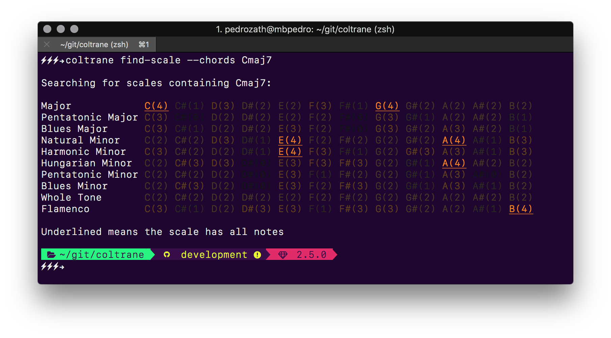
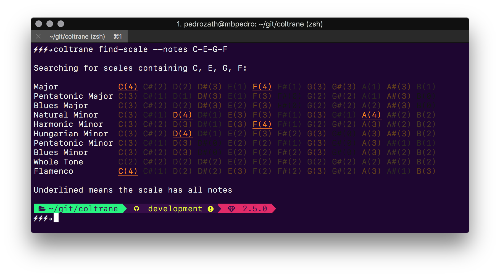
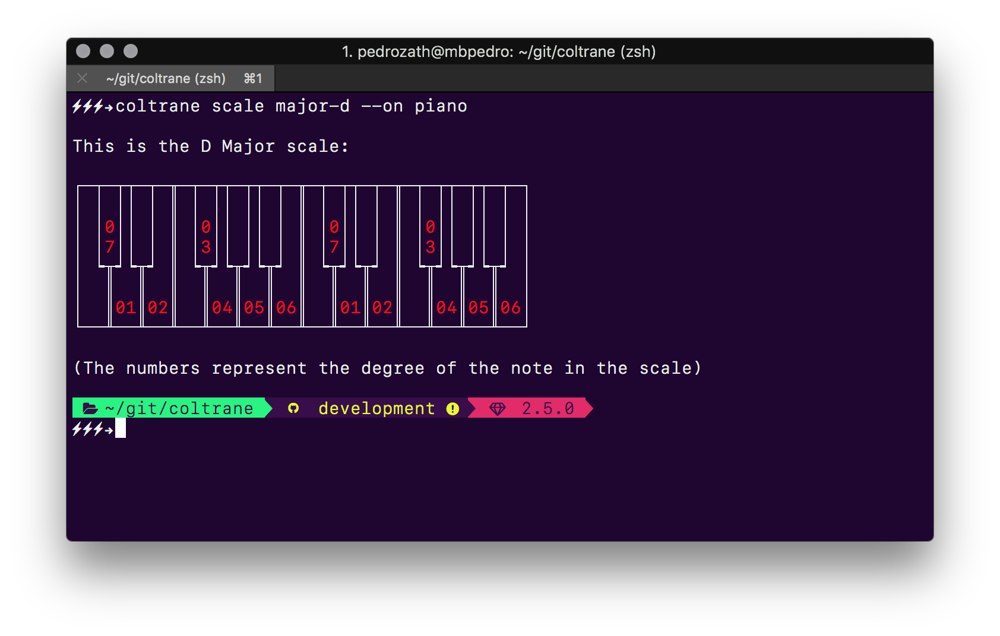
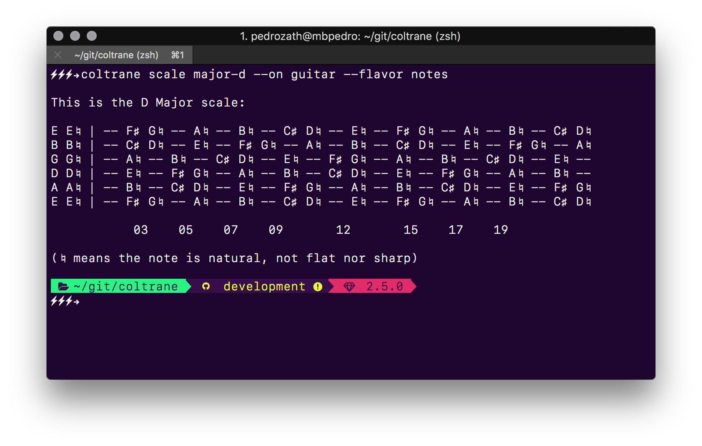
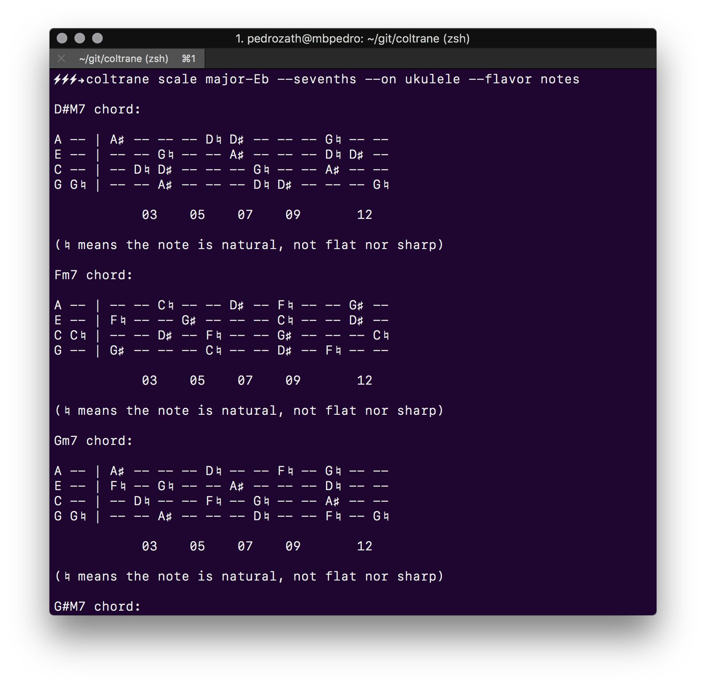
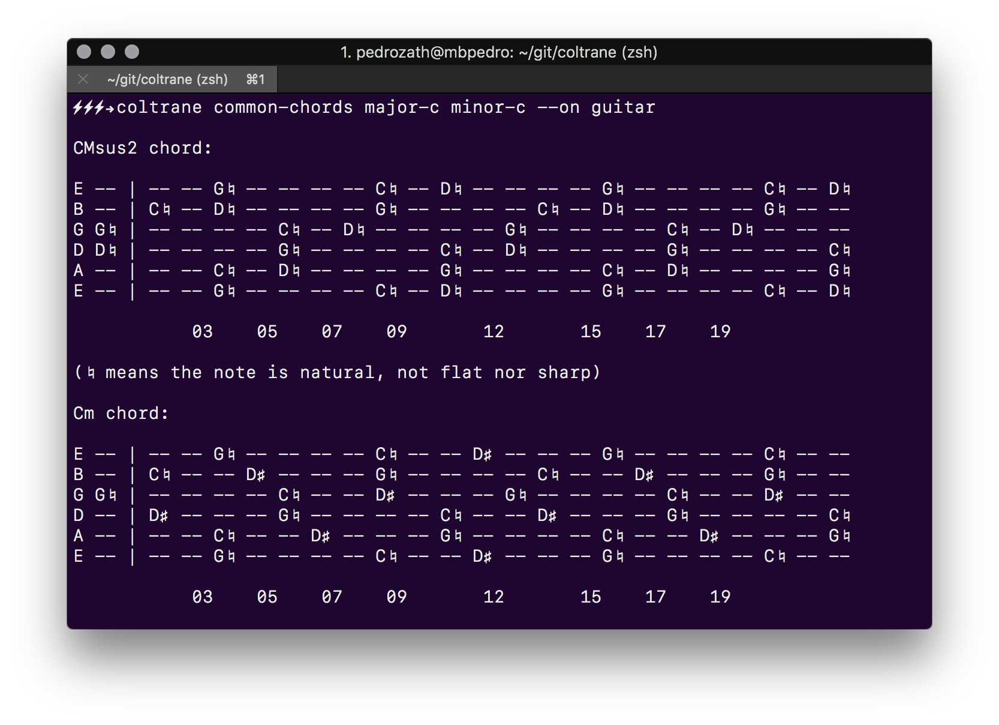
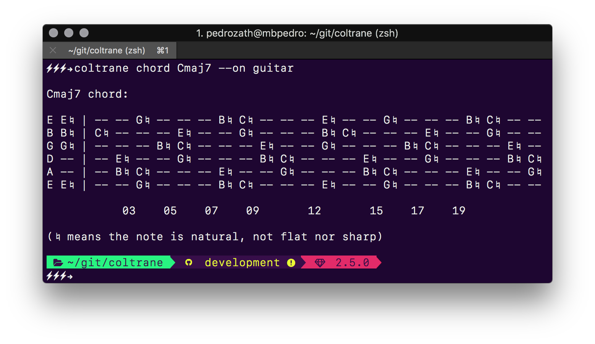
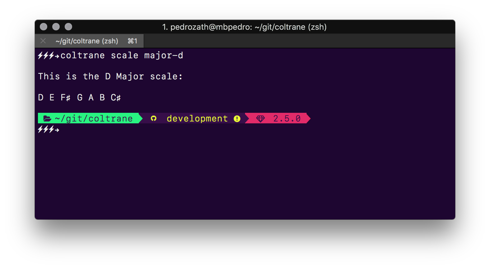
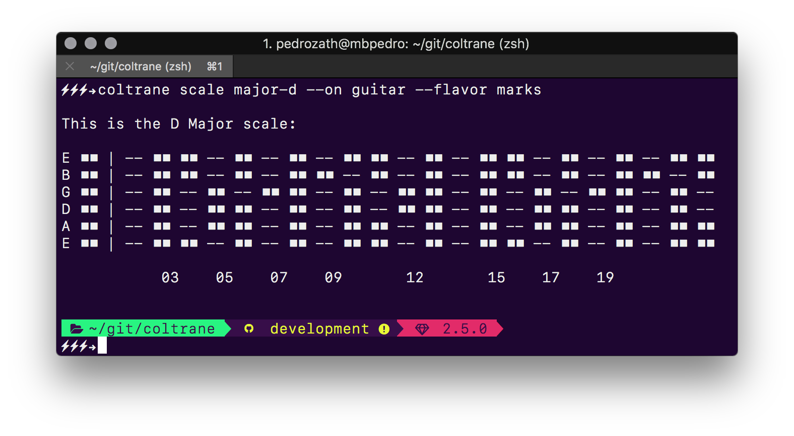

# Coltrane

A musical abacus written in ruby.


More info, story and purpose of the library [here](https://medium.com/@pedrozath/so-i-wrote-a-library-to-help-me-compose-music-ddb4ae7c8227).

## CLI (Command Line Interface)

```bash
$ gem install coltrane
```

When you install the gem on your system, you automatically gain access to the
CLI.

It allows you to query for notes and chords and display them on your favorite instrument. No sheet music reading skills needed. It also allows you to find scales with a chord and find chords shared between two scales (that is actually the main goal when I did this project).

Some screenshot examples:











## As a library

Add this line to your application's Gemfile:

```ruby
gem 'coltrane'
```

And then execute:
```sh
$ bundle
```

The whole library will be available under the `Coltrane` module. The CLI code won't be imported to your application as default. Here's a quick example on how to use it:

```ruby
require 'coltrane'

puts Coltrane::Scale.major('C').sevenths.map(&:name)
# => ["CM7", "Dm7", "Em7", "FM7", "G7", "Am7", "Bm7b5"]

puts Coltrane::Scale.having_chord('Cmaj7').scales.map(&:name)
# => ["C Major", "G Major", "E Natural Minor", "A Natural Minor", "E Harmonic Minor", "B Flamenco"]
```

## Roadmap

There's a lot of things that need to be done on this library, specially on the CLI:

- [ ] Separate into 2 gems: `coltrane` and `coltrane-cli`
- [ ] Make all output more colorful
- [ ] Refactor the CLI into a more succinct and elegantly organized architecture
- [ ] Amplify the test coverage
- [ ] Move Scale#chords method to NoteSet
- [ ] Write tests for the caching
- [ ] Write up a caching cleaning command
- [ ] Include CLI commands to output chord progressions
- [ ] Include a command to output a pretty HTML document containing the query

## Contributing

Install the test suite (RSpec) by running good old `bundle` command

Fork the code, make your changes and maybe write a test or two. Then run:

Then run:
```
bundle exec rspec spec
```

Make sure the specs pass and submit a PR.

## License

The gem is available as open source under the terms of the [MIT License](http://opensource.org/licenses/MIT).

