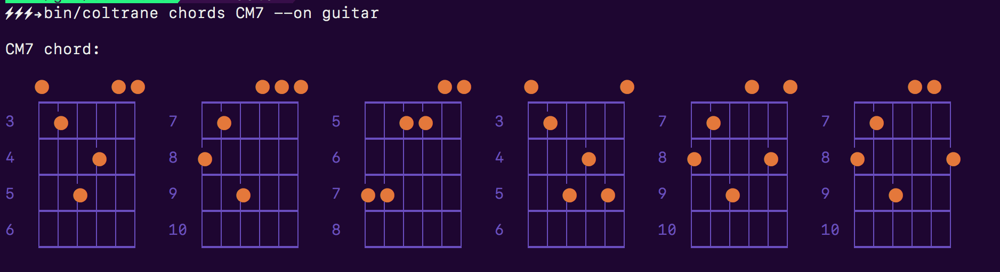

[](https://travis-ci.org/pedrozath/coltrane)
[](https://badge.fury.io/rb/coltrane)
[](https://codeclimate.com/github/pedrozath/coltrane/maintainability)
[](https://codeclimate.com/github/pedrozath/coltrane/test_coverage)

# Coltrane

A music calculation library/CLI written in Ruby.


## CLI (Command Line Interface)




### Features

* Generate chord progressions for Jazz, Blues, Pop, or custom and see how to play them
* Seek chords, see their notes and how to play them
* Seek scales, see their notes and see how to play them
* Find chords that are common between 2 scales
* Find scales containing a chord or a set of notes
* Find possible progressions of a chord sequence
* All of the above can be seen on guitar, bass, piano or ukelele representations, no sheet music needed


### How to discover a chord name using the notes

```sh
coltrane chords --notes C-E-G

CM:  C E G

```

To see it on guitar:

```sh
coltrane chords --notes C-E-G --on guitar

CM:

   ⬤    ⬤  ⬤   ⬤    ⬤  ⬤   ⬤    ⬤             ⬤  ⬤
   ┍━┯━┯━┯━┯━┑    ┍━┯━┯━┯━┯━┑    ┍━┯━┯━┯━┯━┑    ┍━┯━┯━┯━┯━┑
3  │ ⬤│ │ │ │ 8  │ │ │ │ ⬤│ 3  │ ⬤│ │ │ ⬤1  │ │ │ │ ⬤│
   ┝━┿━┿━┿━┿━┥    ┝━┿━┿━┿━┿━┥    ┝━┿━┿━┿━┿━┥    ┝━┿━┿━┿━┿━┥
4  │ │ │ │ │ │ 9  │ │ │ │ │ │ 4  │ │ │ │ │ │ 2  │ │ ⬤│ │ │
   ┝━┿━┿━┿━┿━┥    ┝━┿━┿━┿━┿━┥    ┝━┿━┿━┿━┿━┥    ┝━┿━┿━┿━┿━┥
5  │ │ ⬤│ ⬤│ 10 │ ⬤⬤│ │ │ 5  │ │ ⬤│ ⬤│ 3  ⬤⬤│ │ │ │
   ┝━┿━┿━┿━┿━┥    ┝━┿━┿━┿━┿━┥    ┝━┿━┿━┿━┿━┥    ┝━┿━┿━┿━┿━┥
6  │ │ │ │ │ │ 11 │ │ │ │ │ │ 6  │ │ │ │ │ │ 4  │ │ │ │ │ │
   ┕━┷━┷━┷━┷━┙    ┕━┷━┷━┷━┷━┙    ┕━┷━┷━┷━┷━┙    ┕━┷━┷━┷━┷━┙
```

PS: It looks way better on the terminal 😒, specially on [iTerm](http://iterm2.com)

### How to discover a Scale by providing chords

You shall provide chords separated by dashes (`--chords CM7-Dm7-EM`) or notes (`--notes C-Ab-F-G`).


For example:

```sh
coltrane find-scale --chords E6/9-BM

Pentatonic Major C(1) C#(3) D(3) D#(1) E(5) F(0) F#(4) G(2) G#(2) A(4) A#(0) B(5)
Blues Major      C(2) C#(4) D(3) D#(2) E(5) F(1) F#(4) G(2) G#(3) A(4) A#(1) B(5)
Harmonic Minor   C(3) C#(5) D(2) D#(4) E(4) F(3) F#(4) G(2) G#(5) A(3) A#(3) B(4)
Hungarian Minor  C(2) C#(6) D(2) D#(4) E(3) F(3) F#(5) G(1) G#(5) A(3) A#(4) B(4)
Pentatonic Minor C(1) C#(5) D(0) D#(4) E(2) F(2) F#(4) G(0) G#(5) A(1) A#(3) B(3)
Blues Minor      C(2) C#(5) D(1) D#(4) E(2) F(3) F#(4) G(1) G#(5) A(2) A#(4) B(3)
Whole Tone       C(3) C#(3) D(3) D#(3) E(3) F(3) F#(3) G(3) G#(3) A(3) A#(3) B(3)
Flamenco         C(3) C#(4) D(2) D#(5) E(3) F(3) F#(4) G(3) G#(5) A(2) A#(4) B(4)
Major            C(2) C#(4) D(4) D#(2) E(6) F(1) F#(5) G(3) G#(3) A(5) A#(1) B(6)
Natural Minor    C(2) C#(6) D(1) D#(5) E(3) F(3) F#(5) G(1) G#(6) A(2) A#(4) B(4)
```

When on terminal, the command above will highlight the Scales that have all needed notes. The number in the parenthesis show how many chord notes were included.

### How to find common chords

You may use this command to find a chord that may serve as bridge to a different scale/key (i.e. modulation). Coltrane offers you a command to find common chords shared between both keys/scales. Here is how you use it. Say you wanna transition from C Major to D Natural Minor.

```sh
coltrane common-chords C Major, D Natural Minor

Dm:  D F A
Am:  A C E
Dm7: D F A C
Am7: A C E G
CM:  C E G
FM:  F A C
CM6: C E G A
FM6: F A C D
C6/9: C E G A D
F6/9: F A C D G
C6/9(add11): C E G A D F
[...]
```

You can, whenever it fits, add an `--on <instrument>` to see the output in a graphical representation:

```sh
coltrane common-chords C Major, D Natural Minor --on piano

Dm:

┌─┬─┬┬─┬─╥─┬─┬┬─┬┬─┬─╥─┬─┬┬─┬─╥─┬─┬┬─┬┬─┬─┐
│ │ ││ │ ║ │ ││ ││ │ ║ │ ││ │ ║ │ ││ ││ │ │
│ │ ││ │ ║ │ ││ ││ │ ║ │ ││ │ ║ │ ││ ││ │ │
│ │ ││ │ ║ │ ││ ││ │ ║ │ ││ │ ║ │ ││ ││ │ │
│ ┕╥┙┕╥┙ ║ ┕╥┙┕╥┙┕╥┙ ║ ┕╥┙┕╥┙ ║ ┕╥┙┕╥┙┕╥┙ │
│  ║  ║  ║  ║  ║  ║  ║  ║  ║  ║  ║  ║  ║  │
│  ║D♮║  ║F♮║  ║A♮║  ║  ║D♮║  ║F♮║  ║A♮║  │
└──╨──╨──╨──╨──╨──╨──╨──╨──╨──╨──╨──╨──╨──┘

Am:

┌─┬─┬┬─┬─╥─┬─┬┬─┬┬─┬─╥─┬─┬┬─┬─╥─┬─┬┬─┬┬─┬─┐
│ │ ││ │ ║ │ ││ ││ │ ║ │ ││ │ ║ │ ││ ││ │ │
│ │ ││ │ ║ │ ││ ││ │ ║ │ ││ │ ║ │ ││ ││ │ │
│ │ ││ │ ║ │ ││ ││ │ ║ │ ││ │ ║ │ ││ ││ │ │
│ ┕╥┙┕╥┙ ║ ┕╥┙┕╥┙┕╥┙ ║ ┕╥┙┕╥┙ ║ ┕╥┙┕╥┙┕╥┙ │
│  ║  ║  ║  ║  ║  ║  ║  ║  ║  ║  ║  ║  ║  │
│C♮║  ║E♮║  ║  ║A♮║  ║C♮║  ║E♮║  ║  ║A♮║  │
└──╨──╨──╨──╨──╨──╨──╨──╨──╨──╨──╨──╨──╨──┘

[...]
```

### Quickly generate chord progressions

```sh
coltrane progression jazz in A --on guitar

Bm7:

       ⬤  ⬤       ⬤⬤  ⬤       ⬤⬤           ⬤    ⬤
   ┍━┯━┯━┯━┯━┑    ┍━┯━┯━┯━┯━┑    ┍━┯━┯━┯━┯━┑    ┍━┯━┯━┯━┯━┑
2  ⬤⬤│ ⬤│ ⬤2  ⬤│ │ │ │ ⬤2  ⬤│ │ │ │ ⬤9  │ │ ⬤│ │ │
   ┝━┿━┿━┿━┿━┥    ┝━┿━┿━┿━┿━┥    ┝━┿━┿━┿━┿━┥    ┝━┿━┿━┿━┿━┥
3  │ │ │ │ │ │ 3  │ │ │ │ │ │ 3  │ │ │ │ ⬤│ 10 ⬤│ │ │ │ ⬤
   ┝━┿━┿━┿━┿━┥    ┝━┿━┿━┿━┿━┥    ┝━┿━┿━┿━┿━┥    ┝━┿━┿━┿━┿━┥
4  │ │ │ │ │ │ 4  │ │ │ ⬤│ │ 4  │ │ │ ⬤│ │ 11 │ │ │ ⬤│ │
   ┝━┿━┿━┿━┿━┥    ┝━┿━┿━┿━┿━┥    ┝━┿━┿━┿━┿━┥    ┝━┿━┿━┿━┿━┥
5  │ │ │ │ │ │ 5  │ │ │ │ │ │ 5  │ │ │ │ │ │ 12 │ │ │ │ │ │
   ┕━┷━┷━┷━┷━┙    ┕━┷━┷━┷━┷━┙    ┕━┷━┷━┷━┷━┙    ┕━┷━┷━┷━┷━┙


E7:

   ⬤  ⬤  ⬤⬤           ⬤⬤   ⬤      ⬤⬤   ⬤  ⬤    ⬤
   ┍━┯━┯━┯━┯━┑    ┍━┯━┯━┯━┯━┑    ┍━┯━┯━┯━┯━┑    ┍━┯━┯━┯━┯━┑
1  │ │ │ ⬤│ │ 6  │ │ ⬤│ │ │ 4  │ │ │ ⬤│ │ 1  │ │ │ ⬤│ │
   ┝━┿━┿━┿━┿━┥    ┝━┿━┿━┿━┿━┥    ┝━┿━┿━┿━┿━┥    ┝━┿━┿━┿━┿━┥
2  │ ⬤│ │ │ │ 7  ⬤⬤│ ⬤│ │ 5  │ ⬤│ │ │ │ 2  │ ⬤│ │ │ │
   ┝━┿━┿━┿━┿━┥    ┝━┿━┿━┿━┿━┥    ┝━┿━┿━┿━┿━┥    ┝━┿━┿━┿━┿━┥
3  │ │ │ │ │ │ 8  │ │ │ │ │ │ 6  │ │ ⬤│ │ │ 3  │ │ │ │ ⬤│
   ┝━┿━┿━┿━┿━┥    ┝━┿━┿━┿━┿━┥    ┝━┿━┿━┿━┿━┥    ┝━┿━┿━┿━┿━┥
4  │ │ │ │ │ │ 9  │ │ │ │ │ │ 7  │ │ │ │ │ │ 4  │ │ │ │ │ │
   ┕━┷━┷━┷━┷━┙    ┕━┷━┷━┷━┷━┙    ┕━┷━┷━┷━┷━┙    ┕━┷━┷━┷━┷━┙


A7:

   ⬤⬤  ⬤  ⬤   ⬤⬤      ⬤   ⬤⬤           ⬤⬤  ⬤
   ┍━┯━┯━┯━┯━┑    ┍━┯━┯━┯━┯━┑    ┍━┯━┯━┯━┯━┑    ┍━┯━┯━┯━┯━┑
10 │ │ │ │ ⬤│ 5  │ │ ⬤│ ⬤│ 5  │ │ ⬤│ ⬤⬤9  │ │ │ │ │ ⬤
   ┝━┿━┿━┿━┿━┥    ┝━┿━┿━┿━┿━┥    ┝━┿━┿━┿━┿━┥    ┝━┿━┿━┿━┿━┥
11 │ │ ⬤│ │ │ 6  │ │ │ ⬤│ │ 6  │ │ │ ⬤│ │ 10 │ │ │ │ ⬤│
   ┝━┿━┿━┿━┿━┥    ┝━┿━┿━┿━┿━┥    ┝━┿━┿━┿━┿━┥    ┝━┿━┿━┿━┿━┥
12 │ │ │ │ │ │ 7  │ │ │ │ │ │ 7  │ │ │ │ │ │ 11 │ │ ⬤│ │ │
   ┝━┿━┿━┿━┿━┥    ┝━┿━┿━┿━┿━┥    ┝━┿━┿━┿━┿━┥    ┝━┿━┿━┿━┿━┥
13 │ │ │ │ │ │ 8  │ │ │ │ │ │ 8  │ │ │ │ │ │ 12 │ │ │ │ │ │
   ┕━┷━┷━┷━┷━┙    ┕━┷━┷━┷━┷━┙    ┕━┷━┷━┷━┷━┙    ┕━┷━┷━┷━┷━┙
```

You can say Jazz, Pop, Blues, etc.
You can also generate progressions in a custom way, using roman numerals:

```sh
coltrane progression I-vi-V-iidim in D
```

### Generate fretboard sheets for improvising

Sometimes you wanna see the scale on guitar for improvising:

```sh

coltrane scale F pentatonic --on guitar

F Pentatonic Major:

E -- | F  -- G  -- A  -- -- C  -- D  -- -- F  -- G  -- A  -- -- C  -- D  --
A A  | -- -- C  -- D  -- -- F  -- G  -- A  -- -- C  -- D  -- -- F  -- G  --
D D  | -- -- F  -- G  -- A  -- -- C  -- D  -- -- F  -- G  -- A  -- -- C  --
G G  | -- A  -- -- C  -- D  -- -- F  -- G  -- A  -- -- C  -- D  -- -- F  --
B -- | C  -- D  -- -- F  -- G  -- A  -- -- C  -- D  -- -- F  -- G  -- A  --
E -- | F  -- G  -- A  -- -- C  -- D  -- -- F  -- G  -- A  -- -- C  -- D  --

             03    05    07    09       12       15    17    19
```

The same work for `--on piano`, `--on bass`, `-- on ukulele`, etc.

You can also see the chords by typing `--tertians <size>` or `--chords [size]`. `--tertians` will give you chords by sequential thirds while `--chords` will give you all chords with supplied size (or simply all if empty).

ProTip: You can force the guitar frets visualization for chords too using the `--on guitar_frets` option.

### Finding the progression of a chord sequence

Perhaps this is the most complex operation that Coltrane performs. It searches the chords on all known scales, generates the progression notation and print in, sorted by notes left out. That is because most songs, specially knowadays, may use chords that contain notes which are outside of that scale.

This command us to analyze songs and discover what they have in common, even tho they have different notes.

Let's say we want to find the possible progressions of Red Hot Chili Pepper's Otherside:

```sh
coltrane find-progression Am-F-C-G

i-VI-III-VII   in A Natural Minor (0 notes out)
vi-IV-I-V      in C Major (0 notes out)
iii-I-V-II     in F Major (1 notes out)
vi-III-VII-IV  in D Hungarian Minor (1 notes out)
v-III-VII-IV   in D Natural Minor (1 notes out)
ii-VII-IV-I    in G Hungarian Minor (2 notes out)
ii-VII-IV-I    in G Natural Minor (2 notes out)
vii-V-II-VI    in A# Major (2 notes out)
iv-II-V-III    in D Pentatonic Minor (2 notes out)
v-II-VI-III    in D Blues Minor (2 notes out)
iii-I-IV-II    in F Pentatonic Major (2 notes out)
iv-I-V-II      in F Blues Major (2 notes out)
```

PS: Notice that vi-IV-I-V is the well known I-V-vi-IV progression, [used in a lot of songs](http://www.wikiwand.com/en/List_of_songs_containing_the_I–V–vi–IV_progression).

### Interactive mode (shell)

Simply type `coltrane` or `coltrane shell` to enable interactive mode. You can then run commands without typing `coltrane ` before, E.G.: `scale D harmonic minor`

## Installation

```bash
$ gem install coltrane
```

PS: Once you install the gem the CLI is instaled in your system and it's ready to be used.

## Any questions? Feature requests? Bugs?

1. Find me on [Twitter](https://twitter.com/pedrozath). I'll be glad to answer.
2. Open an issue.
3. Join [our chatroom](http://coltrane-ruby.herokuapp.com/)

## Extra

* [How to use the Core Theory library](https://github.com/pedrozath/coltrane/wiki/Core-music-theory-library).
* [Why did I write this library](https://medium.com/@pedrozath/so-i-wrote-a-library-to-help-me-compose-music-ddb4ae7c8227).
* [Chat room for discussing the project, answering questions, etc.](http://coltrane-ruby.herokuapp.com/)
* [See the changelog](CHANGELOG.md)

## Contributing

We are looking for contributors. Find me on [our chatroom](http://coltrane-ruby.herokuapp.com/) if you need any kind of information.

### How to contribute
1. Fork this code
2. Install the test suite (RSpec) by running good old `bundle` command
3. Make your changes and maybe write a test or two.
4. Check if specs pass `bundle exec rspec spec`
5. Submit a PR.

## License

The gem is available as open source under the terms of the [MIT License](http://opensource.org/licenses/MIT).

by Pedro Maciel | [twitter](http://twitter.com/pedrozath) | pedro@pedromaciel.com
